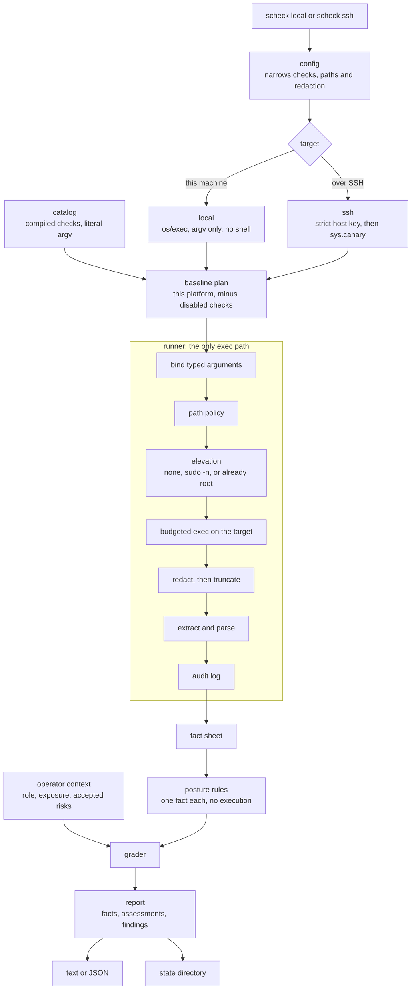

# scheck

A read-only security posture checker for one macOS or Linux host, locally or over
SSH. Every target command comes from a compiled catalog and runs through the same
policy, redaction and audit path. scheck never applies hardening changes: it changes
no configuration, package, unit, credential or security state. Three of its commands
leave a record of their own invocation — `dnf check-update` writes a package-manager
cache, `sudo -n --` writes its timestamp directory, and `ufw status` takes a lock file.
They are listed in [docs/SPEC.md §1](docs/SPEC.md) and the integration suite asserts
that nothing else on the target changes.

**Current build:** collects facts, assesses them with compiled-in posture rules and
grades findings through operator context. A rule reads one fact, so exit 0 and an empty
findings list mean no rule fired — not that the host is secure; read the `assessments`
coverage and the skipped checks. **No model assesses a host:** a model-assessed pass
exists in the codebase and was measured against criteria frozen before it was built,
did not earn its cost, and is therefore not part of this build — the evaluation and the
reasoning are recorded in
[docs/eval/phase2-results.md](docs/eval/phase2-results.md). A run needs no API key and
sends nothing a check observed off the machine. This project is unreleased; interfaces
may change before the first GitHub release.

## How a run works

`scheck local` and `scheck ssh` build one session and then follow the same path.
The catalog is the only command surface, and the runner is the only code that
executes a check. Posture rules read the fact sheet the run produces and do not
execute anything. Operator context grades the findings. No model is on this path.



A context file that lives on the target is read before the baseline, through the
runner, as the `text.cat` check. The state directory copy is skipped with
`--no-persist`. An SSH canary mismatch stops the run before any other command.

## Installation

Binaries are published on [GitHub Releases](https://github.com/b87/scheck/releases)
for Linux and macOS on amd64 and arm64. macOS assets use `darwin` in their name and
are **unsigned and unnotarized**.

[`scripts/install.sh`](scripts/install.sh) does the download, the checksum
verification and the install:

```sh
curl -fsSL https://raw.githubusercontent.com/B87/scheck/main/scripts/install.sh | sh
```

It installs into `/usr/local/bin` when that is writable and `~/.local/bin`
otherwise; `--dir DIR` and `--version TAG` override both. It compares the archive's
SHA-256 against the release's `checksums.txt` before extracting anything and has no
flag to skip that. Read it before piping it to a shell — it is ~150 lines of POSIX
`sh`.

To do the same by hand, download the matching `scheck_VERSION_OS_ARCH.tar.gz` and
`checksums.txt` into an empty directory and verify the archive before extracting:

```sh
sha256sum --ignore-missing -c checksums.txt       # Linux
shasum -a 256 --ignore-missing -c checksums.txt   # macOS
```

Confirm the matching archive reports `OK`, then run `tar -xzf ARCHIVE.tar.gz` and
`./scheck --version`. Install the binary into a directory on your PATH if desired.
On macOS, Gatekeeper may block downloaded unsigned binaries; after verifying the
download and deciding to trust it, use macOS System Settings → Privacy & Security
to allow the application. No Apple notarization is provided.

## Build from source and quick start

With the Go toolchain required by [go.mod](go.mod):

```sh
make build
bin/scheck local --no-persist                                # facts + posture rules; no model, no key
bin/scheck ssh user@host --no-persist
bin/scheck local --context hosts/gateway.yaml                # grade the findings through context
bin/scheck local --stop-after plan                           # what it would run, without running it
bin/scheck config show                                       # effective settings with provenance
```

Operator context (`--context FILE|DIR|note:TEXT|target[:PATH]`, a `context:` block in
`scheck.yaml`, files under `.scheck/context/`) declares the host's role, exposure,
expected services and accepted risks; findings are graded through it with every
change attributed, and `scheck explain FINDING-ID --exposure internet` shows the
chain. See [docs/CONFIGURATION.md](docs/CONFIGURATION.md) and the annotated
[scheck.example.yaml](scheck.example.yaml).

SSH uses strict host-key verification and key/agent authentication. Checks needing
privileges are unavailable unless the session is root or authorized non-interactive
sudo is enabled with `--sudo`. scheck never asks for a password.

## AI agents and automation

```sh
bin/scheck local --format json --no-persist
bin/scheck local --format json --include-evidence --no-persist
bin/scheck catalog --platform linux --format json
bin/scheck explain sshd.config --format json
bin/scheck local --stop-after plan --format json
```

Read stdout, stderr and the exit code separately. Exit 1 means a posture rule found
something at or above the profile threshold; the report is still written. JSON declares
`run.assessment: "rules"` and carries `findings` plus an `assessments` entry per
selected rule (`matched`, `not_matched`, `not_applicable`, `not_assessed`); each fact
includes a one-line `summary`, its status and whether execution was attempted. A typed
fact's records are at `parsed.items`, with `parsed.partial` when the output was
incomplete. Optional evidence is redacted, bounded and extraction-filtered.
Use `--out report.json` to save the report. `--no-persist` disables the additional
state-directory artifact, not an explicit output file or audit log.

Use the repository-local [$scheck skill](.agents/skills/scheck/SKILL.md) to collect
and interpret evidence. It covers JSON discovery, exit codes, diagnostics, elevation
and partial results. For interactive inspection,
`-v` adds descriptions and `-vv` adds available redacted diagnostics.

## Project documentation

- [Specification](docs/SPEC.md): security boundaries and current/planned contracts.
- [Roadmap](docs/ROADMAP-0.0.1.md): implementation status. M0 through M2, M4.5 and M4.6 are done; M4.7 is rehearsed and unpublished.
- [Configuration walkthrough](docs/CONFIGURATION.md): preferences, restrictions and context.
- [Phase 2 criteria](docs/eval/phase2-criteria.md) and [results](docs/eval/phase2-results.md): the frozen gate, its record, and why no model assesses a host in this build.
- [Run report schema](docs/report-schema.json): implemented JSON report shape.
- [Contributor instructions](AGENTS.md): development workflow and required checks.
- [Release runbook](docs/RELEASING.md): GoReleaser, validation evidence and manual publication.

Run `make check` for vet, modernization, lint, the provider-dependency check and race
tests. Container integration tests use `make integ` and require Docker or Podman;
`make live` runs the opt-in tests that spend real money.
