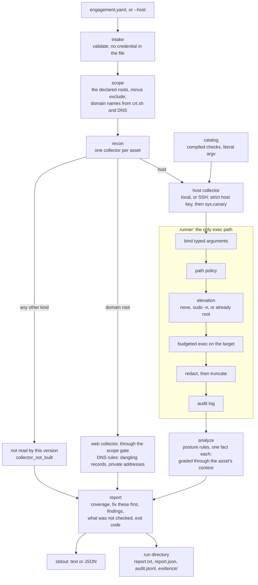

# scheck

A security consultant in a CLI, starting with hosts. `scheck run` takes an engagement
file, or `--host` for one machine, reads what it is allowed to read, and writes a
report that says what was checked, what was not and why, and what to fix first. It only
reads: every command on a host comes from a compiled catalog and runs through the same
policy, redaction and audit path, and scheck changes no configuration, package, unit,
credential or security state. Three of its commands leave a record of their own
invocation — `dnf check-update` writes a package-manager cache, `sudo -n --` writes its
timestamp directory, and `ufw status` takes a lock file. They are listed in
[docs/spec/host-collector.md §1](docs/spec/host-collector.md) and the integration suite
asserts that nothing else on the target changes.

**This build (0.0.2, in development):** the engagement runs its stages (intake, scope,
recon, plan, check, analyze, report) and collects **hosts**, locally or over SSH. A root
of another kind (a Google Workspace tenant, a GitHub organization) is recorded as *not
read by this version* and makes the run exit 2; its collectors arrive with the
[roadmap](docs/ROADMAP.md). Scope lists the names under a `domain` root from
certificate transparency (`crt.sh`) and DNS, contacting no server of yours. Recon then
reads the root's DNS and mail records and, for each name Scope chose, the certificate
and the front page over https and http. Its DNS rules judge what was read: a record
pointing at a name that does not exist, and a public name publishing a private address.
Subdomain takeover, email, TLS and header rules are not built yet, and the report's
coverage says so. The report's "What left this machine" says what was sent where.
Findings come from compiled-in rules: a host's posture rules, graded through the
context the engagement declares, and a domain's DNS rules. A rule reads one fact, so a short
list of findings and exit 0 mean no rule fired — not that anything is secure; the
report's coverage says what was not checked. **No model assesses anything:** a
model-assessed pass exists in the codebase, was measured against criteria frozen
before it was built, did not earn its cost, and is not part of this build
([docs/eval/phase2-results.md](docs/eval/phase2-results.md)). A run needs no API key and
sends nothing it read off the machine. v0.0.1, the host checker, is released; see
[Installation](#installation).

`scheck local` and `scheck ssh` are the 0.0.1 commands. In this build they are
deprecated aliases of `scheck run --host local` and `scheck run --host user@host`,
removed in 0.0.3, and scheck reads no configuration file: a 0.0.1 `scheck.yaml` makes a
run exit 3, naming where each of its keys now lives
([docs/spec/engagement.md](docs/spec/engagement.md), "One command, one file").

See [docs/VISION.md](docs/VISION.md) for where scheck is going: an engagement across
cloud accounts, SaaS tools, repositories, hosts and websites, driven by what you tell it
about your setup.

## How a run works


```mermaid
flowchart TD
  input["engagement.yaml, or --host"] --> intake["intake<br/>validate; no credential in the file"]
  intake --> scope["scope<br/>the declared roots, minus exclude;<br/>domain names from crt.sh and DNS"]
  scope --> recon["recon<br/>one collector per asset"]

  recon -->|host| host["host collector<br/>local, or SSH: strict host key, then sys.canary"]
  recon -->|domain root| web["web collector, through the scope gate<br/>DNS rules: dangling records, private addresses"]
  recon -->|any other kind| none["not read by this version<br/>collector_not_built"]

  catalog["catalog<br/>compiled checks, literal argv"] --> host
  subgraph runner ["runner: the only exec path"]
    bind["bind typed arguments"] --> pathpol["path policy"]
    pathpol --> elevate["elevation<br/>none, sudo -n, or already root"]
    elevate --> execn["budgeted exec on the target"]
    execn --> redact["redact, then truncate"]
    redact --> audit["audit log"]
  end
  host --> bind

  audit --> analyze["analyze<br/>posture rules, one fact each;<br/>graded through the asset's context"]
  none --> report
  web --> report
  analyze --> report["report<br/>coverage, fix these first, findings,<br/>what was not checked, exit code"]
  report --> out["stdout: text or JSON"]
  report --> rundir["run directory<br/>report.txt, report.json, audit.jsonl, evidence/"]
```

An SSH canary mismatch stops that host before any other command; the other assets are
still read and the run exits 3. Every stage writes its document into the run directory
(`<state-dir>/engagements/<name>/<started>/`, created 0700 and locked);
`--no-persist` writes nothing and the report goes to stdout only; it is for host runs
only, since the audit log is the record of what was sent. `scheck run` on that
directory resumes a stopped run: what an earlier session read completely is kept, and
everything else is read again.

## Installation

Binaries are published on [GitHub Releases](https://github.com/b87/scheck/releases)
for Linux and macOS on amd64 and arm64. macOS assets use `darwin` in their name and
are **unsigned and unnotarized**.

[`scripts/install.sh`](scripts/install.sh) does the download, the checksum
verification and the install:

```sh
curl -fsSL https://raw.githubusercontent.com/B87/scheck/main/scripts/install.sh | sh
```

It installs into `/usr/local/bin` when that is writable and `~/.local/bin`
otherwise; `--dir DIR` and `--version TAG` override both. It compares the archive's
SHA-256 against the release's `checksums.txt` before extracting anything and has no
flag to skip that. Read it before piping it to a shell — it is ~150 lines of POSIX
`sh`.

To do the same by hand, download the matching `scheck_VERSION_OS_ARCH.tar.gz` and
`checksums.txt` into an empty directory and verify the archive before extracting:

```sh
sha256sum --ignore-missing -c checksums.txt       # Linux
shasum -a 256 --ignore-missing -c checksums.txt   # macOS
```

Confirm the matching archive reports `OK`, then run `tar -xzf ARCHIVE.tar.gz` and
`./scheck --version`. Install the binary into a directory on your PATH if desired.
On macOS, Gatekeeper may block downloaded unsigned binaries; after verifying the
download and deciding to trust it, use macOS System Settings → Privacy & Security
to allow the application. No Apple notarization is provided.

## Build from source and quick start

With the Go toolchain required by [go.mod](go.mod):

```sh
make build
bin/scheck run --host local                                  # this machine; the engagement report
bin/scheck run --host deploy@203.0.113.5 --identity ~/.ssh/deploy --sudo
bin/scheck run --host deploy@10.0.4.12 --jump ops@bastion.example.com   # through one SSH hop; nothing runs on it
bin/scheck run --host local -v                               # plus the host's fact sheet
bin/scheck run --host deploy@203.0.113.5 --write-engagement engagement.yaml   # contacts nothing
bin/scheck run engagement.yaml --stop-after intake           # validate and print it resolved
bin/scheck run engagement.yaml                               # every stage, through the report
bin/scheck run ~/.local/state/scheck/engagements/<name>/<started>   # resume that run
bin/scheck catalog --profile hardened                        # every check, without running any
```

An engagement file declares the roots to read, each host's reach (`identity`,
`elevate`, `profile`, `timeout`), what to leave out (`exclude`, `disable_checks`,
`deny_paths`, `redact_extra`), the host's context (`role`, `exposure`, `environment`,
`expected_services`) and the risks accepted at a readout (`intent.accepted_risks`).
`--write-engagement` writes the one `--host` builds as a starting point. Each finding in
the report carries a ready-to-paste `accepted_risks` entry for the risks you decide not
to fix. The file's schema and every key are in
[docs/spec/engagement.md](docs/spec/engagement.md); it never holds a credential, and a
file that does is refused without the value being quoted.

SSH uses strict host-key verification and key or agent authentication. Checks needing
privileges are unavailable unless the session is root or authorized non-interactive
sudo is enabled (`--sudo`, or `elevate: sudo` in the file); `scheck sudoers` prints the
least-privilege fragment. scheck never asks for a password.

## AI agents and automation

```sh
bin/scheck run --host local --format json
bin/scheck run --host local --format json --include-evidence --no-persist   # captures on stdout, nothing kept
bin/scheck run engagement.yaml --format json
bin/scheck catalog --platform linux --format json
bin/scheck explain sshd.config --format json
bin/scheck explain sshd.password_auth_enabled --exposure internet --format json
```

Read stdout, stderr and the exit code separately. With `--format json`, stdout is the
engagement report ([docs/engagement-report-schema.json](docs/engagement-report-schema.json)),
the same bytes as the run directory's `report.json`. `exit.code` and `exit.reasons` say
why the run exits as it does: 3 when a host refused us (host key, access, canary), 2
when a declared root was not read or a collection was cut short, 1 when an open finding
is at or above its asset's threshold, in that precedence; exit 0 is not a clean result.
`coverage` marks each risk area `assessed`, `partial`, `not_assessed`, `not_applicable`
or `outside_scheck` with reasons from a closed list; `findings` holds one record per
instance keyed `{id, asset, subject}` with its severity chain and evidence;
`assessments` says for every rule whether it decided on `complete` evidence. Each
host's own report is embedded whole at `assets[i].envelope`
([docs/report-schema.json](docs/report-schema.json)), with its facts, and
`assets[i].trace` is every command sent to it, in order, under `--no-persist` too.
`--include-evidence` adds the redacted captures to stdout only; a host a resume kept
from an earlier session (`kept: true`) has none to add, since no run directory keeps them.

Use the repository-local [scheck skill](.agents/skills/scheck/SKILL.md) to run scheck
and interpret its report; it covers exit codes, coverage, partial results and
elevation. In text, `-v` adds each host's fact sheet and `-vv` its redacted captures.

## Project documentation

- [Vision](docs/VISION.md): what scheck is becoming and the principles behind it.
- [Roadmap](docs/ROADMAP.md): 0.0.2, 0.0.3 and 0.0.4.
- [Specifications](docs/spec/): [engagement](docs/spec/engagement.md) (the file, the
  stages and the report) and [scope](docs/spec/scope.md), [host collector](docs/spec/host-collector.md)
  (what a host asset reads and its guarantees), [domain, email and web
  collector](docs/spec/web-collector.md) (0.0.2 E7, being built), [model path](docs/spec/model.md) and
  [bounded assessment](docs/spec/bounded.md) (kept offline).
- [Phase 2 criteria](docs/eval/phase2-criteria.md) and [results](docs/eval/phase2-results.md): the frozen gate, its record, and why no model assesses a host in this build.
- [Engagement report schema](docs/engagement-report-schema.json) and the
  [host report schema](docs/report-schema.json) it embeds per host.
- [Contributor instructions](AGENTS.md): development workflow and required checks.
- [Release runbook](docs/RELEASING.md): GoReleaser, validation evidence and manual publication.

Run `make check` for vet, modernization, lint, the provider-dependency check and race
tests. Container integration tests use `make integ` and require Docker or Podman;
`make live` runs the opt-in tests that spend real money.
